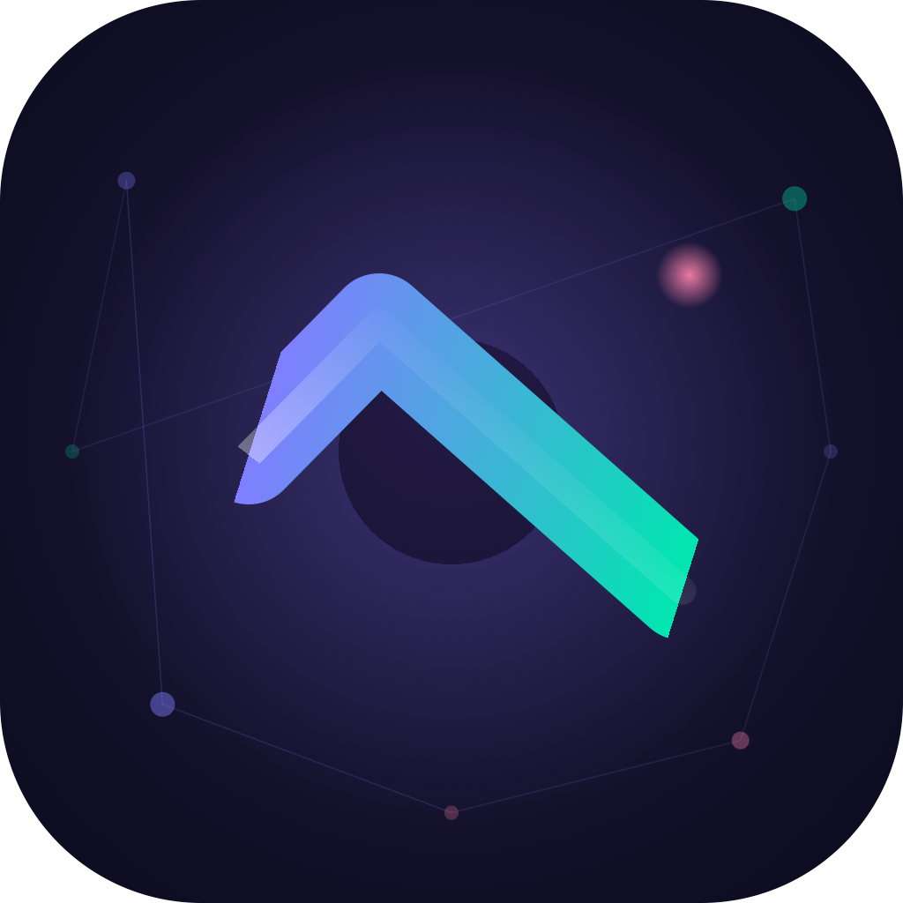

<div align="center">



# GrindCheck

**A native Apple study tracker that tells you the truth about your progress.**

[](https://swift.org)
[](https://developer.apple.com/swiftui/)
[](https://www.apple.com/ios/)
[](https://www.apple.com/macos/)
[](LICENSE)

[Download](#download) · [Getting Started](#getting-started) · [Features](#features) · [Import Format](#subject-json-format) · [Contributing](#contributing)

</div>

---

> I vibe coded this entire app as a personal project because every study app I tried either lied to me about my progress or got in my way. GrindCheck is opinionated, brutal, and built for people who actually want to learn — not just feel like they're learning.
>
> — **Varad Kodgire**

---

## Download

### iOS / macOS (Build from Source)

GrindCheck is not on the App Store yet. You can build it yourself in under 2 minutes:

1. **Clone the repo**
   ```bash
   git clone https://github.com/itsvaradkodgire/GrindCheck.git
   cd GrindCheck
   ```

2. **Open in Xcode**
   ```bash
   open GrindCheck/GrindCheck/GrindCheck.xcodeproj
   ```

3. **Set your signing team**
   - Xcode → Project → Signing & Capabilities → Team → select your Apple ID

4. **Run**
   - Select your device or simulator → `⌘R`

> **Requirements:** Xcode 15+, iOS 17+ device/simulator, or macOS 14+

### Gemini API Key (Required for AI features)

GrindCheck uses Google's Gemini API for AI study guides, coaching, and grading. The free tier is enough.

1. Get a free key at [aistudio.google.com](https://aistudio.google.com/app/apikey)
2. Open the app → **AI Coach** tab → key icon → paste your key
3. The key is stored securely in the iOS/macOS Keychain

---

## Features

<details>
<summary><strong>Feed</strong> — your daily study session view</summary>

- Scrollable card feed that surfaces the most relevant content each session
- **FlashCards** — spaced repetition cards powered by the FSRS algorithm
- **Quiz Cards** — inline questions: MCQ, True/False, Short Answer, Explain This, Code Output
- **Due Review Banner** — highlights cards scheduled for today by the spaced repetition engine
- **Fail → Study Guide** — get a question wrong and a "Read the concept →" button appears, jumping you straight to the relevant study guide section
- **Weekly Debrief** — every Monday: XP delta vs last week, study minutes, quiz count, streak

</details>

<details>
<summary><strong>Quiz</strong> — four modes to match your energy</summary>

- **Quick Fire** — 10 questions, timed, random topics
- **Deep Dive** — 20 questions focused on one subject
- **Mixed Bag** — 15 questions across everything you've studied
- **Weak Spots** — targets topics where your accuracy is lowest
- FSRS updates on every answer — correct answers push the next review date out, wrong answers bring it back
- Post-quiz Session Intelligence — analysis of what to review next

</details>

<details>
<summary><strong>Subjects & Topics</strong> — your knowledge map</summary>

- Grid of subjects, each tracking topics with individual proficiency scores
- **Weak Spot Heatmap** — grid of topics × question types, colored green/yellow/red by accuracy
- **Interview Readiness Score** — weighted formula: proficiency (40%) + coverage (30%) + accuracy (20%) + recency (10%)
- **Pace Projection** — estimates days to 80% proficiency based on your last 7 days of study
- Long-press a subject card → **Export as JSON** (full backup including questions + study guides) or **Delete**

</details>

<details>
<summary><strong>Knowledge Base</strong> — AI-generated study guides</summary>

- Per-topic study guides with 6 section types: Summary, Key Concepts, Explanation, Code Example, Common Mistakes, Quick Reference
- **Teach It Back** — write your own explanation of a section, AI scores it 1–5 stars and shows exactly what you missed
- Verify / flag / edit each section manually — confidence indicators show where the AI was uncertain
- Upload your own JSON study guide (see [format below](#subject-json-format))

</details>

<details>
<summary><strong>AI Coach</strong> — Gemini-powered study companion</summary>

- Chat coach with full conversation history
- **Roadmap Generator** — describe your learning goal in plain language, get a structured phase-by-phase plan imported directly as subjects + topics
- **Weekly Gap Report** — AI identifies your 2–3 weakest concept clusters and tells you what to focus on next
- **Code Analyzer** — paste code, AI infers which topics you've mastered and adjusts confidence scores
- **Job Description Import** — paste a JD, get a skill gap analysis against your current topics with a priority list

</details>

<details>
<summary><strong>Import / Export</strong> — bring your own content</summary>

- **Import Subject from JSON** — download the AI-ready template, fill it in (or hand it to ChatGPT/Claude), upload everything at once: subject + topics + questions + study guides
- **Export Subject to JSON** — long-press any subject → Export as JSON → full backup via iOS Share Sheet
- **Bulk upload questions** per topic via CSV
- **Bulk upload study guide** per topic via JSON
- The template includes inline AI instructions — paste it into any LLM and say *"Fill this for [topic]"*

</details>

<details>
<summary><strong>Profile & Settings</strong></summary>

- Edit name, daily study goal (10–180 min), difficulty preference
- Haptics + sound toggles
- Full progress stats: XP, level, total study hours, longest streak, freeze tokens
- **Reset Everything** — deliberately difficult: requires a 3-second hold to arm, then typing **RESET** exactly in a second confirmation screen

</details>

---

## Getting Started

### First Launch

When you open GrindCheck for the first time it sets up a clean slate — no fake progress, no pre-filled data.

**Option A — Import a full subject (fastest)**

1. Go to **Subjects** → `+` → **Import from JSON**
2. Tap **Download Template**
3. Open [Claude](https://claude.ai) or [ChatGPT](https://chat.openai.com), paste the entire template, and say:
   > *"Fill this GrindCheck template for [your subject, e.g. 'Python for beginners']. For each topic, create 5–8 questions mixing all 5 types and a complete study guide with all 6 sections. Return only valid JSON."*
4. Save the response as a `.json` file
5. Back in the app → **Upload Filled Template** → select the file → **Import Subject**

Everything — subject, topics, questions, and study guides — is created in one shot.

**Option B — Manual**

1. **Subjects** → `+` → **Create Subject** → add a name, icon, and color
2. Open the subject → `+` → **Add Topic** (or **Bulk Add Topics** to paste a list)
3. Open a topic → **Questions** tab → add questions manually or **Bulk Upload** CSV
4. Open a topic → **Study Guide** tab → **Generate** (AI) or **Upload JSON**

**Option C — AI Roadmap**

1. **AI Coach** tab → **Generate Roadmap**
2. Describe your goal in the chat (e.g. *"I want to become a machine learning engineer in 6 months"*)
3. The AI creates a phased roadmap and imports it directly as subjects + topics

---

## Subject JSON Format

This is the format used for both import and export. The template downloaded from the app has full inline documentation for every field.

```json
{
  "subject": {
    "name": "Python",
    "icon": "p.circle.fill",
    "colorHex": "#3776AB"
  },
  "topics": [
    {
      "name": "Functions & Lambda",
      "questions": [
        {
          "questionText": "What is the difference between *args and **kwargs?",
          "questionType": "mcq",
          "options": [
            "*args collects positional args as a tuple; **kwargs collects keyword args as a dict",
            "*args collects keyword args; **kwargs collects positional args",
            "Both collect positional arguments",
            "*args is for integers only"
          ],
          "correctAnswer": "*args collects positional args as a tuple; **kwargs collects keyword args as a dict",
          "explanation": "*args lets a function accept any number of positional arguments as a tuple. **kwargs accepts any number of keyword arguments as a dict.",
          "difficulty": 2,
          "tags": ["functions", "arguments"]
        }
      ],
      "studyGuide": [
        {
          "type": "summary",
          "title": "What are Functions?",
          "content": "Functions are reusable blocks of code defined with `def`. They accept parameters, execute logic, and return values.",
          "confidence": "high"
        },
        {
          "type": "concepts",
          "title": "Key Concepts",
          "content": "- **def**: keyword to define a function\n- **return**: sends a value back to the caller\n- **lambda**: anonymous single-expression function\n- ***args**: variable positional arguments\n- ****kwargs**: variable keyword arguments",
          "confidence": "high"
        }
      ]
    }
  ]
}
```

| Field | Type | Values |
|---|---|---|
| `questionType` | string | `mcq` · `trueFalse` · `shortAnswer` · `explainThis` · `codeOutput` |
| `difficulty` | int | `1` (easiest) → `5` (hardest) |
| `studyGuide.type` | string | `summary` · `concepts` · `explanation` · `code` · `mistakes` · `reference` |
| `studyGuide.confidence` | string | `high` · `medium` · `low` |
| `subject.icon` | string | Any SF Symbol name |
| `subject.colorHex` | string | Hex color e.g. `#FF6B6B` |

---

## Project Structure

```
GrindCheck/
├── GrindCheckApp.swift              # App entry, ModelContainer init + schema recovery
│
├── Models/                          # SwiftData @Model classes
│   ├── UserProfile.swift            # XP, level, streak, goals, freeze tokens
│   ├── Subject.swift                # Top-level subject
│   ├── Topic.swift                  # Chapter/concept with proficiency tracking
│   ├── Question.swift               # Question with full FSRS state
│   ├── TopicArticle.swift           # Study guide container
│   ├── ArticleSection.swift         # Individual guide section with confidence
│   ├── QuizAttempt.swift            # Quiz result with before/after proficiency
│   ├── StudySession.swift           # Timed study session
│   ├── DailyLog.swift               # Daily activity summary
│   ├── Achievement.swift            # Achievement + progress tracking
│   ├── ChatMessage.swift            # AI coach chat history
│   ├── StudyMaterial.swift          # Uploaded study material
│   ├── AIRoadmap.swift + RoadmapPhase.swift
│   ├── AppState.swift               # Global @Observable app state
│   └── Enums.swift                  # QuestionType, DifficultyLevel, SessionType, etc.
│
├── ViewModels/
│   ├── QuizViewModel.swift          # Quiz state machine, FSRS updates, XP awards
│   ├── FeedViewModel.swift          # Card generation, due review, weekly debrief
│   ├── AICoachViewModel.swift       # Gemini chat + tools orchestration
│   └── StudySessionViewModel.swift  # Timer, session tracking
│
├── Services/
│   ├── GeminiService.swift          # All Gemini API calls (REST)
│   ├── FSRSService.swift            # FSRS spaced repetition algorithm
│   ├── ProficiencyEngine.swift      # Question selection, difficulty scaling
│   ├── GamificationEngine.swift     # XP, level-up, achievement unlocks
│   └── WidgetDataService.swift      # Home screen widget data provider
│
├── Views/
│   ├── Feed/                        # Scrollable card feed + all card types
│   ├── Dashboard/                   # Stats, heatmap, XP progress, profile settings
│   ├── Subjects/                    # Grid, detail, topic list, import/export
│   ├── KnowledgeBase/               # Study guide viewer, Teach It Back
│   ├── Quiz/                        # Mode selector, active quiz, results
│   ├── AICoach/                     # Chat, roadmap, tools
│   ├── StudySession/                # Timer, session summary
│   └── Shared/                      # Tab bar, root view, platform adapters
│
├── Resources/
│   ├── SeedDataManager.swift        # First-launch seed data
│   ├── AchievementDefinitions.swift # All achievement definitions
│   └── BrutalMessages.swift         # Honest feedback copy
│
└── Utilities/
    ├── Extensions.swift             # Color(hex:), Date, View, Array helpers
    ├── Constants.swift              # AppColors, GeminiConfig
    ├── HapticManager.swift
    ├── KeychainHelper.swift         # Secure Keychain API key storage
    ├── CSVParser.swift              # Bulk question CSV parser
    └── StudyGuideParser.swift       # Study guide JSON parser
```

---

## Tech Stack

| | Technology |
|---|---|
| **Language** | Swift 5.9 |
| **UI Framework** | SwiftUI |
| **Persistence** | SwiftData |
| **AI** | Google Gemini API (REST — `gemini-1.5-flash`) |
| **Spaced Repetition** | FSRS (Free Spaced Repetition Scheduler) algorithm |
| **Security** | iOS/macOS Keychain (API key storage) |
| **Platform** | iOS 17+ · macOS 14+ (universal) |

---

## Contributing

Pull requests are welcome. For major changes, open an issue first.

1. Fork the repo
2. Create a branch: `git checkout -b feature/your-feature`
3. Commit your changes: `git commit -m 'Add some feature'`
4. Push: `git push origin feature/your-feature`
5. Open a pull request

---

## License

```
MIT License

Copyright (c) 2025 Varad Kodgire

Permission is hereby granted, free of charge, to any person obtaining a copy
of this software and associated documentation files (the "Software"), to deal
in the Software without restriction, including without limitation the rights
to use, copy, modify, merge, publish, distribute, sublicense, and/or sell
copies of the Software, and to permit persons to whom the Software is
furnished to do so, subject to the following conditions:

The above copyright notice and this permission notice shall be included in all
copies or substantial portions of the Software.

THE SOFTWARE IS PROVIDED "AS IS", WITHOUT WARRANTY OF ANY KIND, EXPRESS OR
IMPLIED, INCLUDING BUT NOT LIMITED TO THE WARRANTIES OF MERCHANTABILITY,
FITNESS FOR A PARTICULAR PURPOSE AND NONINFRINGEMENT. IN NO EVENT SHALL THE
AUTHORS OR COPYRIGHT HOLDERS BE LIABLE FOR ANY CLAIM, DAMAGES OR OTHER
LIABILITY, WHETHER IN AN ACTION OF CONTRACT, TORT OR OTHERWISE, ARISING FROM,
OUT OF OR IN CONNECTION WITH THE SOFTWARE OR THE USE OR OTHER DEALINGS IN THE
SOFTWARE.
```

---

<div align="center">

Built with obsession by **[Varad Kodgire](https://github.com/itsvaradkodgire)**

If this helped you — star it ⭐

</div>
